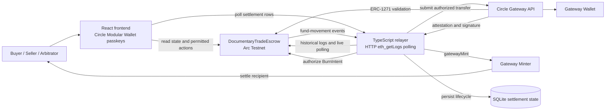

# Arc Trade Escrow architecture

## Responsibility boundaries

- The frontend reads agreement state and submits only user-permitted contract
  actions. It never calls Gateway and never constructs BurnIntents, salts,
  attestations, or operator signatures.
- `DocumentaryTradeEscrow` is the source of truth for agreement state,
  participant authorization, settlement records, and Gateway signature
  validation through ERC-1271.
- The relayer polls historical and live contract logs over HTTP, decodes fund
  movement events, builds and authorizes BurnIntents, submits them to Gateway,
  recovers ambiguous Gateway responses, and calls the Gateway Minter.
- Gateway performs custody movement and returns the attestation and operator
  signature needed for minting.
- SQLite records relayer execution state and retry/recovery history. It does
  not replace the contract as the source of authorization.

## Trust and data flow

Circle Modular Wallet passkeys keep participant signing in the user’s device.
The frontend receives a smart-account signer through the Circle SDK and sends
permitted contract calls to Arc. Private settlement inputs stay in the relayer;
the frontend receives only lifecycle status and transfer metadata produced by
the relayer.
